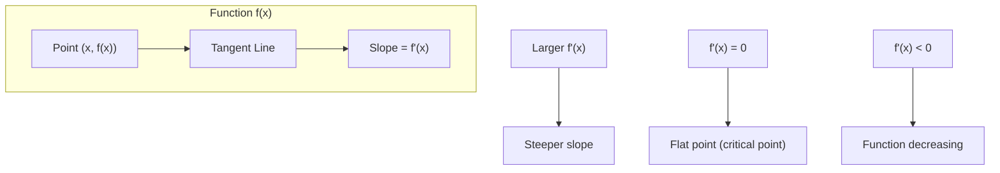
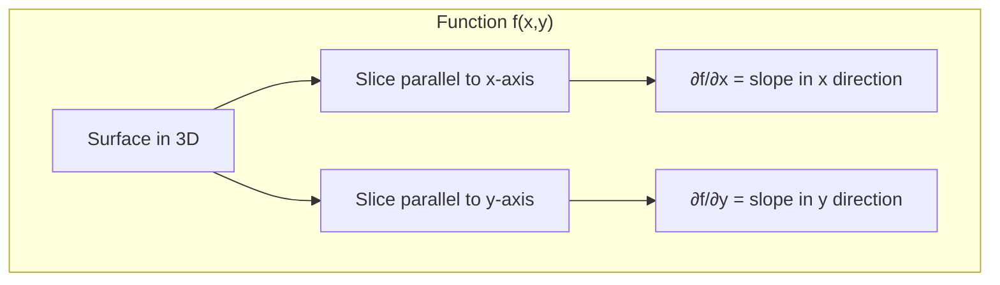
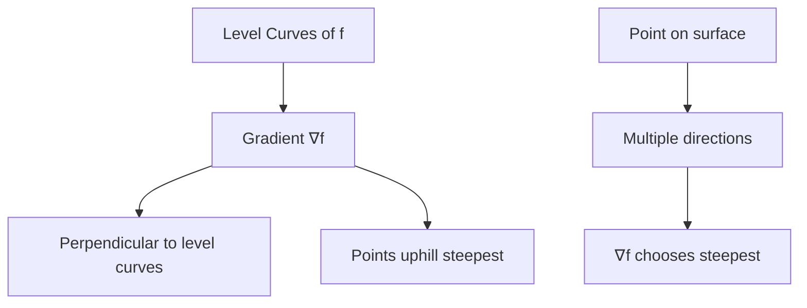
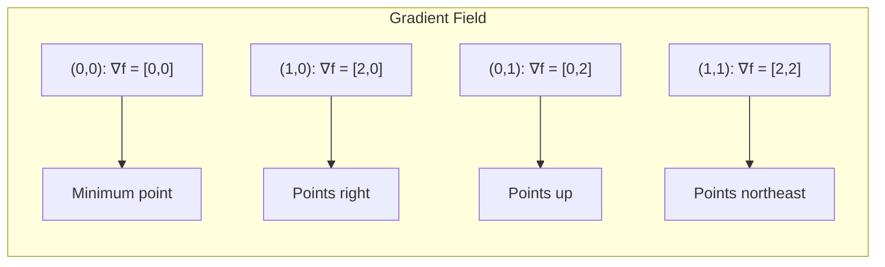
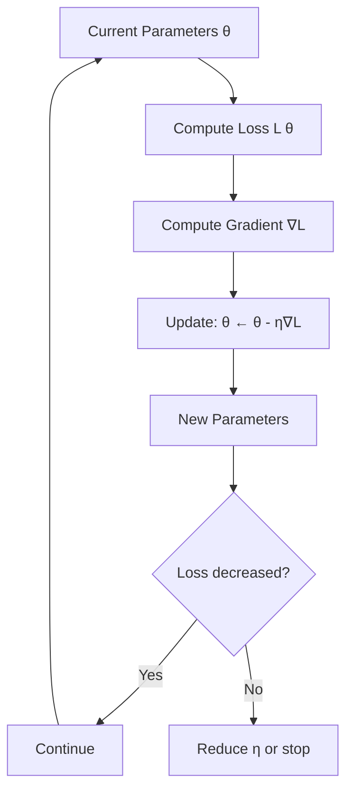
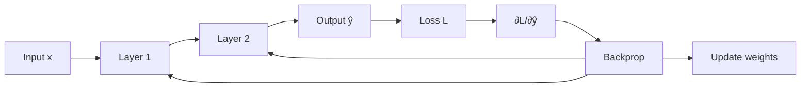

# Topic 01: Derivatives & Gradients

**Phase**: 1 - Mathematical Foundations
**Estimated Time**: 3-4 hours
**Difficulty**: Foundational

---

## Overview

Derivatives and gradients are the mathematical foundation of deep learning. Understanding how functions change is essential for training neural networks through gradient descent.

**What you'll learn**:
- What derivatives represent geometrically and computationally
- How to compute gradients for multivariable functions
- The connection between gradients and optimization
- Why gradients point in the direction of steepest ascent

**Prerequisites**:
- Basic calculus (limits, functions)
- Understanding of slopes and tangent lines

---

## Table of Contents

1. [Single-Variable Derivatives](#single-variable-derivatives)
2. [Partial Derivatives](#partial-derivatives)
3. [Gradients](#gradients)
4. [Directional Derivatives](#directional-derivatives)
5. [Connection to Machine Learning](#connection-to-machine-learning)
6. [Common Mistakes](#common-mistakes)
7. [Interview Questions](#interview-questions)
8. [Exercises](#exercises)

---

## Single-Variable Derivatives

### Definition

The derivative of $f(x)$ at point $x$ measures the **instantaneous rate of change**:

$$f'(x) = \lim_{h \to 0} \frac{f(x+h) - f(x)}{h}$$

### Geometric Interpretation

**Key insights**:
- Derivative = slope of tangent line
- Positive derivative → function increasing
- Negative derivative → function decreasing
- Zero derivative → critical point (local max/min/saddle)

### Example: Computing a Derivative

**Function**: $f(x) = x^2$

**Using definition**:
$$f'(x) = \lim_{h \to 0} \frac{(x+h)^2 - x^2}{h}$$
$$= \lim_{h \to 0} \frac{x^2 + 2xh + h^2 - x^2}{h}$$
$$= \lim_{h \to 0} \frac{2xh + h^2}{h}$$
$$= \lim_{h \to 0} (2x + h) = 2x$$

**Result**: $f'(x) = 2x$

### Common Derivatives

| Function $f(x)$ | Derivative $f'(x)$ |
|-----------------|-------------------|
| $x^n$ | $nx^{n-1}$ |
| $e^x$ | $e^x$ |
| $\ln(x)$ | $\frac{1}{x}$ |
| $\sin(x)$ | $\cos(x)$ |
| $\cos(x)$ | $-\sin(x)$ |

### Rules of Differentiation

**Sum rule**: $(f + g)' = f' + g'$

**Product rule**: $(fg)' = f'g + fg'$

**Quotient rule**: $\left(\frac{f}{g}\right)' = \frac{f'g - fg'}{g^2}$

**Chain rule**: $(f(g(x)))' = f'(g(x)) \cdot g'(x)$

---

## Partial Derivatives

### Motivation

For multivariable functions $f(x_1, x_2, ..., x_n)$, we need to measure how $f$ changes with respect to **each variable individually**.

### Definition

Partial derivative with respect to $x_i$:

$$\frac{\partial f}{\partial x_i} = \lim_{h \to 0} \frac{f(x_1, ..., x_i + h, ..., x_n) - f(x_1, ..., x_i, ..., x_n)}{h}$$

**Intuition**: Rate of change in the $x_i$ direction, **holding all other variables constant**.

### Visual Representation

### Example: Computing Partial Derivatives

**Function**: $f(x, y) = x^2y + 3xy^2 + y^3$

**Partial derivative with respect to $x$** (treat $y$ as constant):
$$\frac{\partial f}{\partial x} = 2xy + 3y^2$$

**Partial derivative with respect to $y$** (treat $x$ as constant):
$$\frac{\partial f}{\partial y} = x^2 + 6xy + 3y^2$$

### Practice Problem

**Function**: $f(x, y, z) = x^2yz + \sin(xz) + e^y$

Solution

$$\frac{\partial f}{\partial x} = 2xyz + z\cos(xz)$$
$$\frac{\partial f}{\partial y} = x^2z + e^y$$
$$\frac{\partial f}{\partial z} = x^2y + x\cos(xz)$$

---

## Gradients

### Definition

The **gradient** is a **vector** containing all partial derivatives:

$$\nabla f = \begin{bmatrix} \frac{\partial f}{\partial x_1} \\ \frac{\partial f}{\partial x_2} \\ \vdots \\ \frac{\partial f}{\partial x_n} \end{bmatrix}$$

**Notation**: $\nabla f$ (read: "nabla f" or "grad f")

### Key Properties

1. **Points in direction of steepest ascent**
2. **Magnitude** = rate of steepest increase
3. **Perpendicular to level curves/surfaces**
4. **Zero at local maxima, minima, and saddle points**

### Geometric Interpretation

### Example: Computing a Gradient

**Function**: $f(x, y) = x^2 + y^2$ (paraboloid)

**Partial derivatives**:
$$\frac{\partial f}{\partial x} = 2x, \quad \frac{\partial f}{\partial y} = 2y$$

**Gradient**:
$$\nabla f = \begin{bmatrix} 2x \\ 2y \end{bmatrix}$$

**At point $(1, 2)$**:
$$\nabla f(1, 2) = \begin{bmatrix} 2 \\ 4 \end{bmatrix}$$

This vector points in the direction of steepest increase from $(1, 2)$.

### Visualization: Gradient Field

For $f(x, y) = x^2 + y^2$:

**Pattern**: Gradients radiate outward from the minimum at origin.

---

## Directional Derivatives

### Motivation

Gradient tells us steepest direction, but what about **any arbitrary direction**?

### Definition

Rate of change in direction of unit vector $\mathbf{u}$:

$$D_{\mathbf{u}}f = \nabla f \cdot \mathbf{u}$$

where $\mathbf{u}$ is a unit vector ($\|\mathbf{u}\| = 1$)

### Key Formula

$$D_{\mathbf{u}}f = \|\nabla f\| \cos\theta$$

where $\theta$ is the angle between $\nabla f$ and $\mathbf{u}$

**Implications**:
- **Maximum** when $\theta = 0$ (direction of $\nabla f$): $D_{\max} = \|\nabla f\|$
- **Minimum** when $\theta = 180°$ (opposite to $\nabla f$): $D_{\min} = -\|\nabla f\|$
- **Zero** when $\theta = 90°$ (perpendicular to $\nabla f$): moving along level curve

### Example

**Function**: $f(x, y) = x^2 + y^2$

**Gradient at $(1, 2)$**: $\nabla f = \begin{bmatrix} 2 \\ 4 \end{bmatrix}$

**Direction**: $\mathbf{u} = \frac{1}{\sqrt{2}}\begin{bmatrix} 1 \\ 1 \end{bmatrix}$ (northeast, 45°)

**Directional derivative**:
$$D_{\mathbf{u}}f = \begin{bmatrix} 2 \\ 4 \end{bmatrix} \cdot \frac{1}{\sqrt{2}}\begin{bmatrix} 1 \\ 1 \end{bmatrix} = \frac{6}{\sqrt{2}} = 3\sqrt{2}$$

---

## Connection to Machine Learning

### Gradient Descent

**Core idea**: Move in **negative gradient direction** to minimize loss

**Update rule**:
$$\theta_{t+1} = \theta_t - \eta \nabla L(\theta_t)$$

where:
- $\theta$: model parameters (weights)
- $L$: loss function
- $\eta$: learning rate (step size)
- $\nabla L$: gradient of loss

### Why Negative Gradient?

- $\nabla L$ points toward **increasing** loss (uphill)
- $-\nabla L$ points toward **decreasing** loss (downhill)
- We want to **minimize** loss, so move downhill

### Example: Linear Regression

**Model**: $\hat{y} = wx + b$

**Loss** (MSE): $L = \frac{1}{n}\sum_{i=1}^n (y_i - \hat{y}_i)^2$

**Gradients**:
$$\frac{\partial L}{\partial w} = -\frac{2}{n}\sum_{i=1}^n x_i(y_i - \hat{y}_i)$$
$$\frac{\partial L}{\partial b} = -\frac{2}{n}\sum_{i=1}^n (y_i - \hat{y}_i)$$

**Updates**:
$$w \leftarrow w - \eta \frac{\partial L}{\partial w}$$
$$b \leftarrow b - \eta \frac{\partial L}{\partial b}$$

### Gradient Flow in Neural Networks

**Forward pass**: Compute predictions
**Backward pass**: Compute gradients (backpropagation)
**Update**: Use gradients to update weights

---

## Common Mistakes

### Mistake 1: Confusing Derivative with Slope

**Wrong thinking**: "Derivative is the slope"

**Correct thinking**: "Derivative is the instantaneous rate of change, which geometrically represents the slope of the tangent line"

### Mistake 2: Forgetting Chain Rule

**Problem**: $f(x) = e^{x^2}$

**Wrong**: $f'(x) = e^{x^2}$

**Correct**: $f'(x) = e^{x^2} \cdot 2x$ (chain rule!)

### Mistake 3: Partial Derivatives Don't "See" Other Variables

**Problem**: $f(x, y) = x^2y$

**Wrong**: $\frac{\partial f}{\partial x} = 2xy$ treating $y$ as variable

**Correct**: $\frac{\partial f}{\partial x} = 2xy$ where $y$ is treated as constant

(In this case, the answer looks similar but the reasoning is different!)

### Mistake 4: Gradient is a Vector, Not a Scalar

**Wrong**: "The gradient is 2x + 4y"

**Correct**: "The gradient is $\begin{bmatrix} 2x \\ 4y \end{bmatrix}$"

### Mistake 5: Negative Gradient for Minimization

**Wrong**: Update $\theta \leftarrow \theta + \eta \nabla L$ (moving uphill!)

**Correct**: Update $\theta \leftarrow \theta - \eta \nabla L$ (moving downhill)

---

## Interview Questions

### Question 1: Explain the geometric interpretation of a gradient

Answer

The gradient $\nabla f$ is a vector that:
1. **Points in the direction of steepest ascent** of the function
2. Has **magnitude equal to the rate of steepest increase**
3. Is **perpendicular to level curves/surfaces**

At a point, if you want to increase $f$ as quickly as possible, move in the direction of $\nabla f$. To decrease $f$ (minimize), move in direction of $-\nabla f$.

### Question 2: Why do we use negative gradient in gradient descent?

Answer

The gradient $\nabla L$ points in the direction of **increasing** loss. Since we want to **minimize** loss, we move in the **opposite direction** (negative gradient): $\theta \leftarrow \theta - \eta \nabla L$.

This is analogous to walking downhill: the gradient points uphill, so we go the opposite direction to reach the valley (minimum).

### Question 3: What does it mean when the gradient is zero?

Answer

When $\nabla f = \mathbf{0}$, the point is a **critical point**, which could be:
1. **Local minimum** (what we usually want in ML)
2. **Local maximum** (undesirable)
3. **Saddle point** (neither min nor max)

To distinguish, you'd need to check the second derivative (Hessian matrix).

In machine learning, we use gradient descent to find points where $\nabla L \approx 0$, hoping they're good minima.

### Question 4: Compute the gradient of $f(x, y) = x^2y + \sin(xy)$

Answer

$$\frac{\partial f}{\partial x} = 2xy + y\cos(xy)$$
$$\frac{\partial f}{\partial y} = x^2 + x\cos(xy)$$

$$\nabla f = \begin{bmatrix} 2xy + y\cos(xy) \\ x^2 + x\cos(xy) \end{bmatrix}$$

### Question 5: If you're at a point where $\nabla f = [3, 4]$, in which direction should you move to increase $f$ fastest?

Answer

Move in the direction of the gradient: $\mathbf{u} = \frac{[3, 4]}{\|[3, 4]\|} = \frac{[3, 4]}{5} = [0.6, 0.8]$

The rate of increase will be $\|\nabla f\| = 5$ (magnitude of gradient).

### Question 6: What's the relationship between gradient and level curves?

Answer

The gradient $\nabla f$ is **perpendicular (orthogonal) to level curves**.

Level curves are curves where $f(x, y) = c$ (constant). Moving along a level curve doesn't change $f$, so the rate of change is zero in that direction. Since the gradient points in the direction of maximum increase, it must be perpendicular to the direction of zero change (the level curve).

---

## Exercises

See [exercises.py](./exercises.py) for coding exercises and [solutions.py](./solutions.py) for complete solutions.

### Exercise 1: Numerical Derivative

Implement a function to compute the numerical derivative using the definition:
$$f'(x) \approx \frac{f(x + h) - f(x - h)}{2h}$$

### Exercise 2: Gradient Computation

Implement a function to numerically compute the gradient of a multivariable function.

### Exercise 3: Gradient Descent Step

Implement one step of gradient descent given a function and current parameters.

### Exercise 4: Directional Derivative

Compute the directional derivative in a given direction.

---

## Key Takeaways

✓ **Derivatives** measure instantaneous rate of change

✓ **Partial derivatives** measure change with respect to one variable

✓ **Gradient** is a vector of all partial derivatives

✓ **Gradient points toward steepest ascent**; magnitude = rate of increase

✓ **Gradient descent** uses $-\nabla L$ to minimize loss

✓ **Zero gradient** indicates critical points (min/max/saddle)

✓ **Directional derivative** = gradient dotted with unit direction vector

---

## Next Steps

After mastering derivatives and gradients, you're ready for:

**Next topic**: [Topic 02: Chain Rule & Backpropagation Mathematics](../02-chain-rule-backprop/topic.md)

**Related topics**:
- Topic 03: Partial Derivatives & Jacobians
- Topic 07: Backpropagation Algorithm
- Topic 10: Optimization Algorithms

---

## Additional Resources

### For Deeper Understanding

- **3Blue1Brown**: "Essence of Calculus" YouTube series
- **Khan Academy**: Multivariable Calculus
- **MIT OpenCourseWare**: 18.02 Multivariable Calculus

### Interactive Visualizations

- **Desmos**: Graph functions and see tangent lines
- **GeoGebra**: 3D function visualizations
- **Wolfram Alpha**: Compute derivatives and gradients

---

**Ready to practice?** Head to [exercises.py](./exercises.py)!
