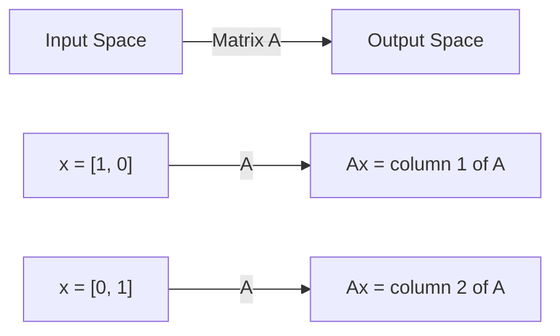
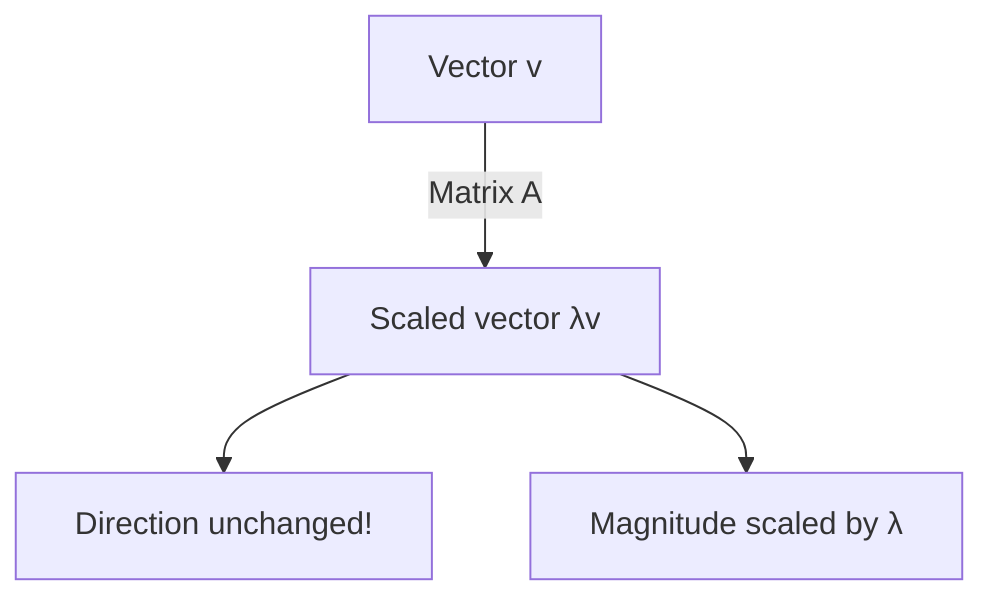
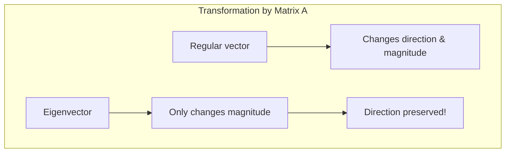
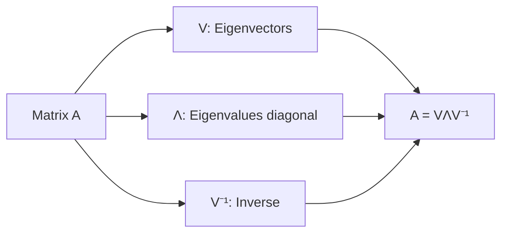
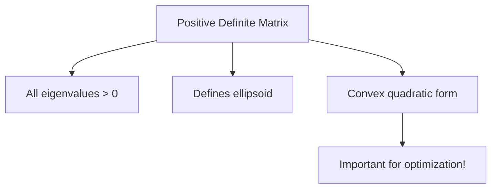
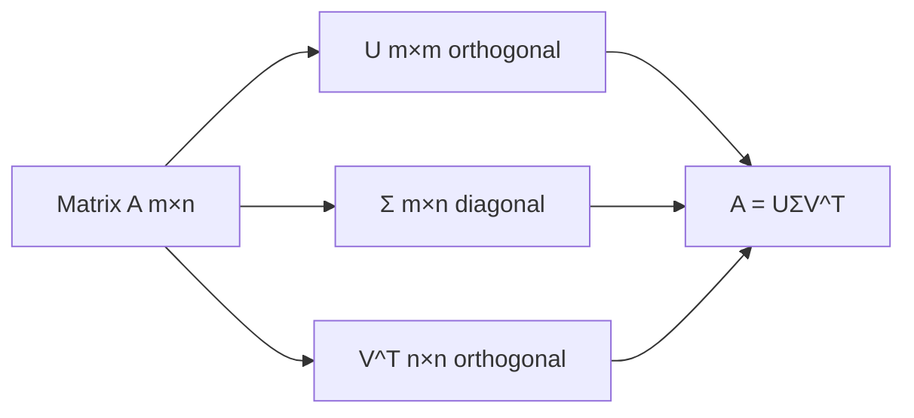
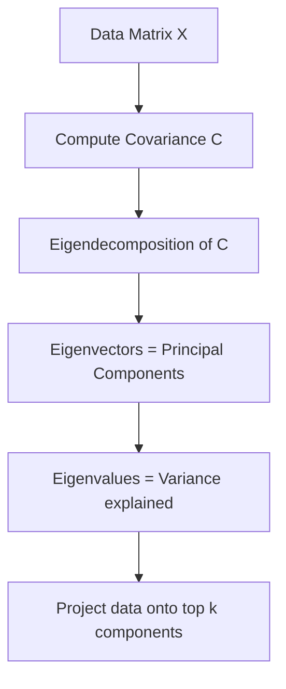

# Topic 02: Linear Algebra & Eigendecomposition

**Phase**: 1 - Mathematical Foundations
**Estimated Time**: 4-5 hours
**Difficulty**: Foundational

---

## Overview

Linear algebra is the mathematical foundation of machine learning. Matrices represent data, transformations, and learned parameters. Eigendecomposition reveals fundamental properties of transformations and is crucial for PCA, optimization, and understanding neural network behavior.

**What you'll learn**:
- Matrix operations and their geometric interpretations
- Eigenvalues and eigenvectors - what they mean and how to compute them
- Eigendecomposition and Singular Value Decomposition (SVD)
- Applications: PCA, covariance analysis, stability analysis
- Why certain matrices (positive definite, symmetric) are special

**Prerequisites**:
- Basic understanding of vectors and matrices
- Matrix multiplication

---

## Table of Contents

1. [Matrices as Linear Transformations](#matrices-as-linear-transformations)
2. [Eigenvalues and Eigenvectors](#eigenvalues-and-eigenvectors)
3. [Computing Eigenvalues](#computing-eigenvalues)
4. [Eigendecomposition](#eigendecomposition)
5. [Special Matrices](#special-matrices)
6. [Singular Value Decomposition (SVD)](#singular-value-decomposition-svd)
7. [Applications in Machine Learning](#applications-in-machine-learning)
8. [Common Mistakes](#common-mistakes)
9. [Interview Questions](#interview-questions)
10. [Exercises](#exercises)

---

## Matrices as Linear Transformations

### Geometric Interpretation

A matrix $A$ represents a **linear transformation** - it transforms input vector $\mathbf{x}$ to output vector $\mathbf{y}$:

$$\mathbf{y} = A\mathbf{x}$$



**Key insight**: Columns of $A$ tell us where basis vectors land after transformation.

### Example: 2D Rotation

Rotation by angle $\theta$:

$$R = \begin{bmatrix} \cos\theta & -\sin\theta \\ \sin\theta & \cos\theta \end{bmatrix}$$

For $\theta = 90°$:

$$R = \begin{bmatrix} 0 & -1 \\ 1 & 0 \end{bmatrix}$$

This rotates $\begin{bmatrix} 1 \\ 0 \end{bmatrix}$ to $\begin{bmatrix} 0 \\ 1 \end{bmatrix}$ (counterclockwise 90°)

### Types of Transformations

| Matrix | Effect | Example |
|--------|--------|---------|
| Diagonal | Scaling along axes | $\begin{bmatrix} 2 & 0 \\ 0 & 3 \end{bmatrix}$ |
| Rotation | Rotates vectors | $\begin{bmatrix} \cos\theta & -\sin\theta \\ \sin\theta & \cos\theta \end{bmatrix}$ |
| Reflection | Mirrors across line | $\begin{bmatrix} 1 & 0 \\ 0 & -1 \end{bmatrix}$ |
| Shear | Skews space | $\begin{bmatrix} 1 & k \\ 0 & 1 \end{bmatrix}$ |

---

## Eigenvalues and Eigenvectors

### Definition

For square matrix $A$, vector $\mathbf{v}$ is an **eigenvector** with **eigenvalue** $\lambda$ if:

$$A\mathbf{v} = \lambda\mathbf{v}$$

**Geometric meaning**: $A$ transforms $\mathbf{v}$ by simply scaling it (no rotation, just stretch/shrink)



### Why Eigenvectors Are Special

Most vectors **change direction** when transformed by $A$. Eigenvectors **maintain direction** (only get scaled).

**Example**: Stretching transformation

$$A = \begin{bmatrix} 3 & 0 \\ 0 & 2 \end{bmatrix}$$

- Eigenvector $\mathbf{v}_1 = \begin{bmatrix} 1 \\ 0 \end{bmatrix}$ with $\lambda_1 = 3$
- Eigenvector $\mathbf{v}_2 = \begin{bmatrix} 0 \\ 1 \end{bmatrix}$ with $\lambda_2 = 2$

Verification:
$$A\mathbf{v}_1 = \begin{bmatrix} 3 & 0 \\ 0 & 2 \end{bmatrix}\begin{bmatrix} 1 \\ 0 \end{bmatrix} = \begin{bmatrix} 3 \\ 0 \end{bmatrix} = 3\mathbf{v}_1 \checkmark$$

### Geometric Visualization



### Properties of Eigenvalues

1. **Number**: $n \times n$ matrix has (at most) $n$ eigenvalues
2. **Can be**: Real or complex
3. **Determinant**: $\det(A) = \prod_i \lambda_i$ (product of eigenvalues)
4. **Trace**: $\text{tr}(A) = \sum_i \lambda_i$ (sum of eigenvalues)

---

## Computing Eigenvalues

### The Characteristic Equation

To find eigenvalues, solve:

$$\det(A - \lambda I) = 0$$

This is called the **characteristic polynomial**.

### Example: 2x2 Matrix

$$A = \begin{bmatrix} 4 & 1 \\ 2 & 3 \end{bmatrix}$$

**Step 1**: Form $A - \lambda I$

$$A - \lambda I = \begin{bmatrix} 4-\lambda & 1 \\ 2 & 3-\lambda \end{bmatrix}$$

**Step 2**: Compute determinant

$$\det(A - \lambda I) = (4-\lambda)(3-\lambda) - (1)(2) = \lambda^2 - 7\lambda + 10$$

**Step 3**: Solve characteristic equation

$$\lambda^2 - 7\lambda + 10 = 0$$
$$(\lambda - 5)(\lambda - 2) = 0$$

**Eigenvalues**: $\lambda_1 = 5, \lambda_2 = 2$

### Finding Eigenvectors

For each eigenvalue $\lambda$, solve $(A - \lambda I)\mathbf{v} = \mathbf{0}$

**For** $\lambda_1 = 5$:

$$(A - 5I)\mathbf{v} = \begin{bmatrix} -1 & 1 \\ 2 & -2 \end{bmatrix}\begin{bmatrix} v_1 \\ v_2 \end{bmatrix} = \begin{bmatrix} 0 \\ 0 \end{bmatrix}$$

This gives $-v_1 + v_2 = 0$, so $v_2 = v_1$

**Eigenvector**: $\mathbf{v}_1 = \begin{bmatrix} 1 \\ 1 \end{bmatrix}$ (or any scalar multiple)

### Computational Approach: Power Iteration

For large matrices, use iterative methods:

```python
# Power iteration (finds dominant eigenvalue/eigenvector)
v = random_vector()
for i in range(iterations):
    v = A @ v
    v = v / np.linalg.norm(v)  # Normalize

eigenvalue = v.T @ A @ v  # Rayleigh quotient
```

**Converges to**: Eigenvector with largest $|\lambda|$

---

## Eigendecomposition

### Matrix Diagonalization

If $A$ has $n$ linearly independent eigenvectors, we can write:

$$A = V\Lambda V^{-1}$$

where:
- $V$ = matrix whose columns are eigenvectors
- $\Lambda$ = diagonal matrix of eigenvalues



### Why This Is Useful

**Computing powers**: $A^k = V\Lambda^k V^{-1}$

Since $\Lambda$ is diagonal:

$$\Lambda^k = \begin{bmatrix} \lambda_1^k & 0 \\ 0 & \lambda_2^k \end{bmatrix}$$

This is **much faster** than computing $A \cdot A \cdot ... \cdot A$ ($k$ times)

### Example Application: Fibonacci

Fibonacci recurrence: $F_{n+1} = F_n + F_{n-1}$

Matrix form:
$$\begin{bmatrix} F_{n+1} \\ F_n \end{bmatrix} = \begin{bmatrix} 1 & 1 \\ 1 & 0 \end{bmatrix}\begin{bmatrix} F_n \\ F_{n-1} \end{bmatrix}$$

Using eigendecomposition gives **closed-form formula** for $F_n$!

---

## Special Matrices

### Symmetric Matrices

**Definition**: $A = A^T$

**Properties**:
- All eigenvalues are **real**
- Eigenvectors are **orthogonal**
- Always diagonalizable: $A = Q\Lambda Q^T$ where $Q$ is orthogonal

**Example**:
$$A = \begin{bmatrix} 2 & 1 \\ 1 & 2 \end{bmatrix}$$

Eigenvalues: $\lambda_1 = 3, \lambda_2 = 1$

Eigenvectors: $\mathbf{v}_1 = \frac{1}{\sqrt{2}}\begin{bmatrix} 1 \\ 1 \end{bmatrix}, \mathbf{v}_2 = \frac{1}{\sqrt{2}}\begin{bmatrix} 1 \\ -1 \end{bmatrix}$ (orthogonal!)

### Positive Definite Matrices

**Definition**: Symmetric matrix $A$ is positive definite if $\mathbf{x}^T A \mathbf{x} > 0$ for all $\mathbf{x} \neq \mathbf{0}$

**Equivalent conditions**:
- All eigenvalues $> 0$
- All leading principal minors $> 0$

**Geometric interpretation**: Transformation stretches in all directions (no compression or reflection)

**In ML**: Covariance matrices are positive semi-definite



### Diagonal Matrices

$$D = \begin{bmatrix} d_1 & 0 & \cdots & 0 \\ 0 & d_2 & \cdots & 0 \\ \vdots & \vdots & \ddots & \vdots \\ 0 & 0 & \cdots & d_n \end{bmatrix}$$

**Properties**:
- Eigenvalues = diagonal entries
- Eigenvectors = standard basis vectors
- Easy to compute powers, inverse

### Orthogonal Matrices

**Definition**: $Q^T Q = I$ (columns are orthonormal)

**Properties**:
- Preserves lengths: $\|Q\mathbf{x}\| = \|\mathbf{x}\|$
- Preserves angles
- Determinant = ±1
- Eigenvalues have $|\lambda| = 1$

**Examples**: Rotation matrices, reflection matrices

---

## Singular Value Decomposition (SVD)

### Definition

**Every** matrix $A$ (not just square!) can be decomposed as:

$$A = U\Sigma V^T$$

where:
- $U$: Left singular vectors (orthogonal)
- $\Sigma$: Diagonal matrix of singular values ($\sigma_i \geq 0$)
- $V$: Right singular vectors (orthogonal)



### Relationship to Eigendecomposition

- **Singular values** of $A$ = square roots of eigenvalues of $A^T A$
- **Right singular vectors** = eigenvectors of $A^T A$
- **Left singular vectors** = eigenvectors of $AA^T$

### Why SVD Is More General

- Works for **non-square** matrices
- Works for **singular** matrices (non-invertible)
- Always exists (eigendecomposition doesn't always exist)

### Geometric Interpretation

SVD decomposes **any** linear transformation into:
1. **Rotation** ($V^T$)
2. **Scaling** ($\Sigma$)
3. **Rotation** ($U$)

---

## Applications in Machine Learning

### 1. Principal Component Analysis (PCA)

**Goal**: Find directions of maximum variance in data

**Method**: Eigendecomposition of covariance matrix



**Steps**:
1. Center data: $X \leftarrow X - \text{mean}(X)$
2. Compute covariance: $C = \frac{1}{n}X^T X$
3. Find eigenvectors/eigenvalues of $C$
4. Keep top $k$ eigenvectors (largest eigenvalues)
5. Project: $X_{reduced} = XV_k$

**Why eigenvalues matter**: Larger eigenvalue = more variance = more important direction

### 2. Stability Analysis

**Gradient descent convergence** depends on eigenvalues of Hessian:

- All $\lambda > 0$: Converges to minimum
- Some $\lambda < 0$: Saddle point or maximum
- $\lambda$ near 0: Slow convergence

**Condition number**: $\kappa = \frac{\lambda_{max}}{\lambda_{min}}$

- Large $\kappa$: Ill-conditioned (difficult optimization)
- Small $\kappa$: Well-conditioned (easy optimization)

### 3. Spectral Graph Theory

**Graph Laplacian**: $L = D - A$

- $D$: Degree matrix
- $A$: Adjacency matrix

**Eigenvectors of $L$**:
- Reveal community structure
- Used in graph neural networks
- Spectral clustering

### 4. Matrix Factorization (Recommender Systems)

**Goal**: Approximate rating matrix $R \approx UV^T$

**SVD approach**:
1. Compute $R = U\Sigma V^T$
2. Keep top $k$ singular values
3. Low-rank approximation: $R_k = U_k \Sigma_k V_k^T$

### 5. Image Compression

SVD for image compression:
- Image = matrix of pixels
- SVD = $A = U\Sigma V^T$
- Keep top $k$ singular values/vectors
- Compressed size: $(m + n)k$ vs $mn$

---

## Common Mistakes

### Mistake 1: Confusing Eigenvalues with Eigenvectors

**Wrong**: "The eigenvalue is $[1, 2]$"

**Correct**:
- Eigenvalue: **scalar** ($\lambda = 3$)
- Eigenvector: **vector** ($\mathbf{v} = [1, 2]^T$)

### Mistake 2: Forgetting Eigenvectors Are Not Unique

Eigenvector $\mathbf{v}$ means **any scalar multiple** $c\mathbf{v}$ is also an eigenvector (same $\lambda$)

**Common practice**: Normalize eigenvectors to unit length

### Mistake 3: Assuming All Matrices Are Diagonalizable

Not all matrices have eigendecomposition:
- Need $n$ linearly independent eigenvectors
- Example: $\begin{bmatrix} 1 & 1 \\ 0 & 1 \end{bmatrix}$ is not diagonalizable

**Solution**: Use Jordan normal form or SVD instead

### Mistake 4: Ignoring Complex Eigenvalues

Real matrices can have **complex eigenvalues** (come in conjugate pairs)

**Example**: Rotation matrix has complex eigenvalues $e^{i\theta}$

### Mistake 5: Thinking Larger Eigenvalue = More Important

**Depends on context**:
- PCA: YES (larger = more variance)
- Stability: NO (sign matters more than magnitude)
- Neural networks: Depends on application

---

## Interview Questions

### Question 1: Explain eigenvalues and eigenvectors intuitively

<details>
<summary>Answer</summary>

An eigenvector of matrix $A$ is a special direction that doesn't change when $A$ transforms it - it only gets scaled. The eigenvalue is the scaling factor.

**Analogy**: Imagine stretching a rubber sheet. Most points move in complex ways, but some directions only get stretched (not rotated). Those directions are eigenvectors, and how much they stretch is the eigenvalue.

**Mathematical**: $A\mathbf{v} = \lambda\mathbf{v}$ means applying transformation $A$ to $\mathbf{v}$ just scales it by $\lambda$.

</details>

### Question 2: How do you compute eigenvalues?

<details>
<summary>Answer</summary>

**Analytically** (small matrices):
1. Form characteristic equation: $\det(A - \lambda I) = 0$
2. Solve polynomial for $\lambda$
3. For each $\lambda$, solve $(A - \lambda I)\mathbf{v} = 0$ for eigenvector $\mathbf{v}$

**Numerically** (large matrices):
- Power iteration (dominant eigenvalue)
- QR algorithm
- Arnoldi/Lanczos methods
- Use NumPy: `np.linalg.eig(A)`

For symmetric matrices, use `np.linalg.eigh(A)` (faster, guaranteed real eigenvalues)

</details>

### Question 3: What is PCA and how does it use eigendecomposition?

<details>
<summary>Answer</summary>

**PCA** (Principal Component Analysis) finds directions of maximum variance in data.

**Method**:
1. Compute covariance matrix: $C = \frac{1}{n}X^T X$ (after centering)
2. Find eigendecomposition: $C = V\Lambda V^T$
3. Eigenvectors ($V$) = principal components (directions)
4. Eigenvalues ($\Lambda$) = variance along each direction
5. Sort by eigenvalue (descending)
6. Keep top $k$ components for dimensionality reduction

**Why eigendecomposition?** Covariance matrix is symmetric, so:
- Eigenvectors are orthogonal (uncorrelated components)
- Eigenvalues tell us importance (variance explained)

</details>

### Question 4: What's the difference between eigendecomposition and SVD?

<details>
<summary>Answer</summary>

| Eigendecomposition | SVD |
|-------------------|-----|
| $A = V\Lambda V^{-1}$ | $A = U\Sigma V^T$ |
| Square matrices only | Any matrix (rectangular OK) |
| May not exist | Always exists |
| Eigenvectors (may not be orthogonal) | Singular vectors (always orthogonal) |
| Eigenvalues (can be complex/negative) | Singular values (always real, non-negative) |

**When to use**:
- Eigendecomposition: Symmetric matrices, theoretical analysis
- SVD: General matrices, numerical stability, data analysis

</details>

### Question 5: Why are positive definite matrices important?

<details>
<summary>Answer</summary>

**Positive definite** means $\mathbf{x}^T A \mathbf{x} > 0$ for all $\mathbf{x} \neq 0$

**Equivalent**: All eigenvalues $> 0$

**Importance**:

1. **Optimization**: Positive definite Hessian → local minimum
   - Negative definite → local maximum
   - Indefinite → saddle point

2. **Covariance matrices**: Always positive semi-definite
   - Positive definite if no perfect correlations

3. **Stability**: Positive definite → stable dynamical system

4. **Numerical**: Easy to compute inverse, Cholesky decomposition

5. **Geometry**: Defines ellipsoid (all directions are "expansions")

</details>

### Question 6: What does the condition number tell you?

<details>
<summary>Answer</summary>

**Condition number**: $\kappa(A) = \frac{\sigma_{max}}{\sigma_{min}} = \frac{\lambda_{max}}{\lambda_{min}}$

**Interpretation**:
- $\kappa \approx 1$: Well-conditioned (round ellipse, easy optimization)
- $\kappa \gg 1$: Ill-conditioned (stretched ellipse, hard optimization)

**Effects**:
- **Gradient descent**: Large $\kappa$ → slow convergence, zig-zagging
- **Numerical stability**: Large $\kappa$ → sensitive to small errors
- **Neural networks**: Large $\kappa$ in Hessian → training difficulties

**Solutions**:
- Preconditioning (make $\kappa$ smaller)
- Better optimizers (Adam adapts to conditioning)
- Batch normalization (reduces ill-conditioning)

</details>

---

## Exercises

See [exercises.py](./exercises.py) for coding exercises and [solutions.py](./solutions.py) for complete solutions.

### Exercise 1: Compute Eigenvalues & Eigenvectors

Implement characteristic polynomial method for 2x2 matrices

### Exercise 2: Power Iteration

Implement power iteration to find dominant eigenvalue/eigenvector

### Exercise 3: PCA from Scratch

Implement PCA using eigendecomposition

### Exercise 4: Check Positive Definiteness

Implement function to check if matrix is positive definite

### Exercise 5: Matrix Powers Using Eigendecomposition

Compute $A^k$ efficiently using eigendecomposition

### Exercise 6: SVD Image Compression

Compress grayscale image using SVD

### Exercise 7: Condition Number Analysis

Analyze how condition number affects gradient descent

---

## Key Takeaways

✓ **Eigenvectors** maintain direction under transformation (only scaled)

✓ **Eigenvalues** are the scaling factors

✓ **Eigendecomposition**: $A = V\Lambda V^{-1}$ (when it exists)

✓ **SVD**: $A = U\Sigma V^T$ (always exists, more general)

✓ **Symmetric matrices** have real eigenvalues, orthogonal eigenvectors

✓ **Positive definite** means all eigenvalues $> 0$ (important for optimization)

✓ **PCA** uses eigendecomposition of covariance matrix

✓ **Condition number** = ratio of largest to smallest eigenvalue (affects optimization)

✓ **Applications**: PCA, stability analysis, graph algorithms, compression, recommender systems

---

## Next Steps

After mastering linear algebra and eigendecomposition, you're ready for:

**Next topic**: [Topic 03: Chain Rule & Backpropagation Mathematics](../03-chain-rule-backprop/topic.md)

**Related topics**:
- Topic 01: Derivatives & Gradients (uses linear algebra)
- Topic 04: Partial Derivatives & Jacobians (matrix calculus)
- Topic 07: Neural Network Forward Pass (matrix operations)

---

## Additional Resources

### For Deeper Understanding

- **3Blue1Brown**: "Essence of Linear Algebra" YouTube series (highly recommended!)
- **Gilbert Strang**: MIT 18.06 Linear Algebra
- **Interactive Linear Algebra** (online textbook with visualizations)

### Interactive Visualizations

- **Eigenvectors visualizer**: seeing.org
- **Matrix transformations**: mathinsight.org
- **PCA visualization**: setosa.io/ev/principal-component-analysis

---

**Ready to practice?** Head to [exercises.py](./exercises.py)!
